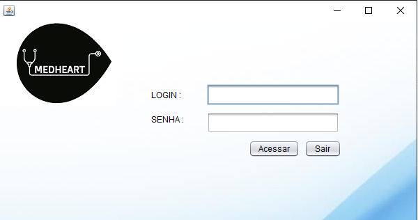

     

# Clínica Médica com Interface Gráfica

Este repositório é um trabalho acadêmico desenvolvido em Java com a finalidade de simular uma clínica médica.

# Screenshot

# Licença

Este projeto está sob licença [MIT](https://choosealicense.com/licenses/mit/) © 2020 Adriana Mirian Mendes Cardoso. 

Para mais informações acesse o arquivo :scroll:`LICENSE.md`.

# Contato

:email: E-Mail: ​[adriana.cardoso@aluno.ufop.edu.br](adriana.cardoso@aluno.ufop.edu.br) 

:clipboard: Linkedin: ​[https://www.linkedin.com/in/adriana-mendes-engenheira-de-computacao/](https://www.linkedin.com/in/adriana-mendes-engenheira-de-computacao/)

:package: GitHub:  [https://github.com/AdrianaMendes](https://github.com/AdrianaMendes)
